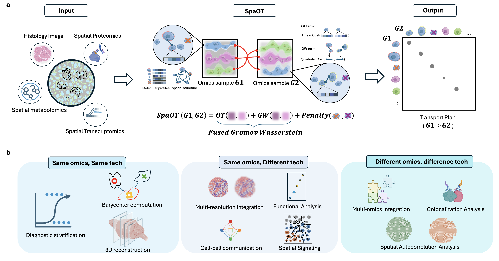

# SpaOT

SpaOT (Spatial Optimal Transport) is a spatial multi-omics integration framework for aligning heterogeneous spatial omics samples. It implements a total variation-regularized Fused Partial Gromov-Wasserstein (FPGW) formulation that combines molecular or learned feature similarity with spatial structure while allowing unmatched mass. This makes the algorithm suitable for samples with different cellular composition, measurement throughput, resolution, modality, and noise.



## Algorithm

SpaOT represents each spatial omics sample as a metric-measure space:

- nodes are cells, spots, pixels, image tiles, or other spatial units;
- node features encode molecular profiles, image embeddings, or another shared representation;
- structural matrices encode within-sample spatial distances;
- node masses encode the amount of source and target mass available for transport.

For a source sample and a target sample, SpaOT optimizes a transport plan by combining:

- an OT term, which compares source and target features through a cross-sample cost matrix;
- a GW term, which compares source and target spatial structures through pairwise distance matrices;
- a partial/unbalanced mass penalty, which permits noisy, missing, or modality-specific regions to remain unmatched.

The resulting transport plan can be used for spatial alignment, label transfer, feature imputation, cross-resolution mapping, and cross-modality integration. The transport cost can be used as a sample-level distance or as an input to barycenter computation.

## Installation

Install the core Python dependencies:

```bash
pip install -r requirements.txt
```


## Basic Usage

### Toy Data

Download the toy dataset here: [graph_data_input_matrices.npz](https://github.com/ShuangWang1/SpaOT/tree/main/toy_data/graph_data_input_matrices.npz)

```python
import numpy as np

from lib.fused_pgw import fused_partial_gromov_wasserstein, fused_pgw_cost

data = np.load("graph_data_input_matrices.npz")

M = data["M"] # M: source-by-target feature cost matrix
C1 = data["C1"] # C1: source structural distance matrix
C2 = data["C2"] # C2: target structural distance matrix

n_source, n_target = M.shape
p = np.ones(n_source) / max(n_source, n_target)
q = np.ones(n_target) / max(n_source, n_target)

transport_plan = fused_partial_gromov_wasserstein(
    M,
    C1,
    C2,
    p=p,
    q=q,
    omega2=0.5,
    Lambda=1.0,
    Type="pot",
)

cost = fused_pgw_cost(
    M,
    C1,
    C2,
    transport_plan,
    omega2=0.5,
    loss_fun="square_loss",
)
```

Important parameters:

- `M`: source-by-target feature cost matrix.
- `C1`, `C2`: source and target structural distance matrices.
- `p`, `q`: source and target node mass vectors.
- `omega2`: structure-feature tradeoff. `0.0` reduces to partial OT, `1.0` emphasizes partial GW, and intermediate values run the fused SpaOT objective.
- `Lambda`: penalty controlling unmatched mass in the partial formulation.
- `Type`: linear OT backend used by the solver.

## Preparing Inputs

For a typical SpaOT run:

1. Normalize features for each modality.
2. Construct a shared feature space or feature-cost matrix across samples.
3. Compute `M` with a distance such as Euclidean or cosine distance.
4. Compute `C1` and `C2` from spatial coordinates.
5. Scale feature and structure costs to comparable ranges.
6. Choose node masses, commonly uniform masses for a first run.
7. Run `fused_partial_gromov_wasserstein`.
8. Use the transport plan for mapping or the transport cost for downstream distance-based analysis.

## Barycenter Utilities

`lib/fused_pgw_barycenter.py` implements FPGW barycenter routines for summarizing a collection of spatial samples. Barycenters can be used to estimate a representative spatial organization for a group of samples and to compare groups through SpaOT-derived distances.


